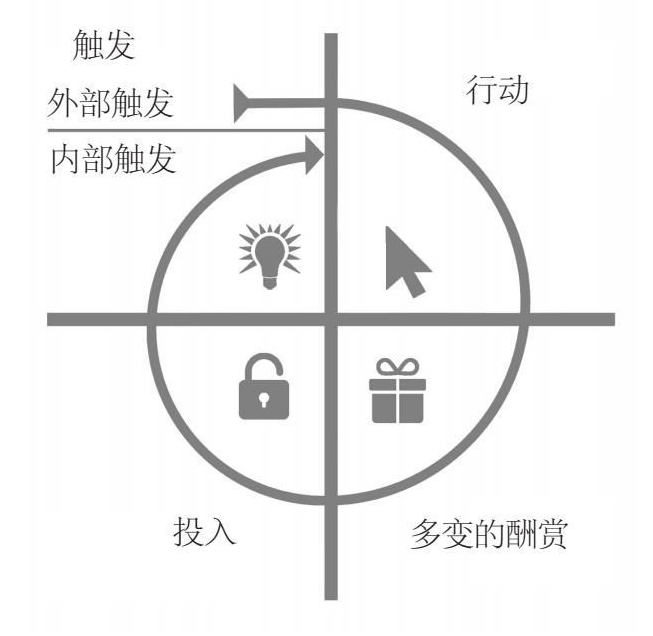

《上瘾》

[豆瓣链接](https://book.douban.com/subject/27030507/)

# 序言

一百年前，产品销售比拼的是**产能**，所以发明流水线、提高生产率的福特成为时代明星；五十年前，产品销售比拼的是**渠道和营销**，所以铺货能力强、广告预算高的宝洁成为市场霸主；可是当今这个时代，产品销售比拼的是如何**占领消费者的心智**。产品本身就是最好的营销。

苹果产品的设计，用其风格奠定者艾斯林格的话说：**形式追随情感**（而非功能）。功能是理性的、认知的，情感是感性的、直觉的。苹果的设计无疑是优美的，同时还足够好用，因此捕获了用户的心智。

由于网络将渠道成本大大压缩，**信息不对称性显著改观**，推广成本也急剧降低，产品的存亡与否实际上取决于产品本身。伴随着互联网崛起产生的第二个变化，是**个人的崛起**（个性化需求变得更重要）。

是什么让产品脱颖而出？

> 当产品进入了用户的“习惯区间”，产品就获得了持续的生命力。

那么如何让用户习惯于使用你的产品呢？

> 这本书给出了一个极其简明的上瘾模型（the Hook Model）：触发——行动——多变的酬赏——投入。（详细内容在后面章节）

用户喜欢上一款产品的过程，也就是跟产品谈恋爱的过程。（过程具有可比性）

工业时代，用户与产品的关系，好像包办婚姻，买什么产品由厂家和渠道决定，由不得你爱不爱。互联网时代，用户与产品的关系，完全是自由恋爱，爱谁不爱谁，用户有极大的自主权。

# 前言

2013年的一个调查显示，79%的智能手机用户会在早晨起床后的15分钟内翻看手机。2011年的另一个调查则显示，人们每天平均要看手机34次，想想2018年这个数字会上升到多少。

而且绝大多数用户应该主要使用少数几款app，付款用支付宝，社交用微信，书影音用豆瓣，等等。这些应用已经让人有了习惯，想到某个场景，首先想到的就是某个应用。

根据认知心理学家的界定，所谓习惯，就是一种**在情境暗示下产生的无意识行为**，是我们几乎不假思索就做出的举动。

越来越多的企业已经清醒地认识到，仅凭占有庞大的客户群并不足以构成竞争优势。**用户对产品的依赖性强弱**才是决定其经济价值的关键。

培养用户习惯的公司并不依赖于费用高昂的营销策划，而是**将产品设计与用户的行为习惯和情感状态紧密相连**。让人“上瘾”的应用在产品中“安装”了“内部触发”。当你遇到一个难题，还没有开动大脑，就已经打开了Google。

传统广告业的黄金时代已经过去了，人们对广告心怀戒备。初创公司通过“钓钩”式的体验来改变用户行为习惯。这算是新旧两种方式了。

在研究了虚拟游戏和广告这两种都依赖思维操控的产业之后，作者开始研究产品是如何改变人们行为的。有对上千家公司的观察评测，也有基于消费者心理学、人机互动和行为经济学这样的学术视角。其中心得发布在了[NirAndFar](NirAndFar.com)，这些研究帮助作者创建了**上瘾模型**——一个四阶段模型。

1. 触发：促使用户做出某种行为的诱因，分内部和外部两种。
2. 行动：用户在对**某种回报**心怀期待的情况下做出的举动。
3. 多变的酬赏：如果反馈结果是可预料的，那么用户不会心怀期待。
4. 投入：当用户为某产品提供其个人数据和社会资本，付出时间、精力和金钱时，投入就发生了。

企业快速采集和整理用户信息能力的提高，以及与用户之间联结性的不断增强，使我们即将步入一个**一切皆有可能塑造人们习惯的新时代**。

这个新时代好的一面是，**集网络连接、海量数据和超快网速这三者于一身的技术**，会为人们培养健康的行为习惯提供前所未有的机遇。

钓钩将用户面临的问题与企业的应对策略衔接在一起，二者频繁互动，最终形成稳定的用户使用习惯。这里的重点是要明白用户的问题，而非企业自己的问题：）

# 第一章 习惯的力量：让产品从维生素变成止痛药

**人类将近一半的日常活动都受制于习惯**。习惯是大脑借以掌握复杂举动的途径之一。神经系统科学家指出，人脑中存在一个负责无意识行为的基底神经节，**那些无意中产生的条件反射会以习惯的形式存储在基底神经节中，从而使人们腾出精力来关注其他的事物**。

所以，习惯是一种shortcut。

## 企业从习惯中获益

习惯的这一特点自然会被某些企业所利用。事实上，精于此道的企业一直将培养用户习惯作为其产品开发的一个基本原则。习惯一经养成，用户无须外部诱因即可开始某种活动。

本书中所提到的产品，主要出自那些**要求用户能主动参与其中，并因此需要借助用户习惯来推广**产品的行业。用户对产品的依赖会给企业带来如下好处：

* 提升**用户终身价值（customer lifetime value）**，即一个用户在其有生之年忠实使用某个产品的过程中为其付出的投资总额。信用卡持卡人一般会成为长期的忠实用户，因此它的CLV相当高。
* 提高价格的灵活性，巴菲特曾经说过，“要衡量一个企业是否强大，就要看看它在提价问题上经历过多少痛苦”。某些游戏从免费开始，等玩家上瘾后，掏腰包也就顺理成章了。Evernote和iCloud是典型的例子，当用户使用量越来越多时，改换工具阻力也变大，少量付费也就容易完成了。
* 加快增长速度，持续使用某产品的用户成为此中的guru，往往乐于和朋友分享这份感受，为企业做免费的宣传。
* 提高竞争力。用户对产品的依赖是一种竞争优势。一旦某个产品能够让用户改变自己的生活习惯，那其他产品就几乎不具任何威胁。新产品要想在市场上站稳脚跟，**略胜一筹是远远不够的，必须要有绝对优势**。很多人都知道常规QWERTY键盘设计很”糟糕“，但目前还看不到它有任何竞争者。因为要用户改变习惯的代价太大了。

##垄断思维

培养新习惯的过程中，最大的阻碍就是旧习惯（比如Bing对Google的挑战）。要想让新习惯在用户的生活中生根发芽，就必须增加它的出现频率。

## 基于习惯的发展策略

## 习惯的区间

要想打造习惯养成类产品，企业务必认真考虑两个因素，即**使用频率和可感知用途**。若某种行为发生的频率足够高，被感知到的用途足够多，就会进入我们的“习惯区间”。即使某app用途很丰富，若使用频率过低，也不能发展为习惯；另一方面，若某app用途较小，但使用频率颇高，依然可发展为习惯。

## 维生素 vs. 止痛药

凡是成功的创新都有一个共性：**能够解决问题**。但人们总是对新产品应该解决何种问题各执一词。

“你生产的是维生素还是止痛药？”当企业创始人渴望得到第一笔风险投资时，投资人总是喜欢向他们提出这个老套的问题。他们希望听到的是”止痛药“，投资人和总经理就像是企业的守门员。

止痛药可以满足人们的显性需求，缓解身体某部位的疼痛感。与之相比，维生素不一定能缓解表面的痛苦。它可以满足用户的情感需求，但满足不了他们对功能的要求。而且维生素的效果到底如何，人们并不确定。

那么选择止痛药而非维生素，永远是正确的策略吗？不一定。类似于Facebook这样的服务，更像是维生素，尤其是对于新用户而言，几天不更新状态也没什么。但对于每天都要刷很多遍的用户而言，”不能刷“变成了一种”痛“，更确切的说法是”痒“。

习惯养成类产品会在用户的大脑中建立一种联结，使他们一感觉到痛痒就会想要使用这个产品。

## 小结

并非所有企业都一定需要用户形成使用习惯，比如信用卡app或12306（尽管很多人吐槽，却别无选择）。

## 练习

如果做一款招聘类的app，求职者不易形成使用习惯，中小型公司的HR也不易，但猎头是可以考虑的。除了解决三者的基本功能需求，考虑为求职者添加职业生涯相关的信息推送；为HR和猎头亦有高相关的推送。每天用户可以看到有价值的信息，这属于”惊喜“部分。这样可以将产品放在用户经常可以看到的地方，形成依赖。

目前的常见模式是，求职者求职期间主动搜索，搜索效果不佳，对于新增职位也不能实时接收到，HR和猎头亦然。用户对产品的期望值很低，粘性也很低，容易转移到其它产品。

若提供了有价值的服务，用户想到”招聘“，就会想到这款产品，也很有可能推荐给朋友使用。

# 第二章 触发：提醒人们采取下一步行动

Instagram是一款颇为流行的app，忠实用户数量达到1.5亿（2012年）。其团队既通晓技术，又深谙消费者心理。它的用户可能意识不到自己已经上瘾（豆瓣用户也类似）。这类习惯在日复一日的生活中逐渐打磨而成，但习惯的形成过程都始于某个触发。

## 习惯不会凭空养成，只会逐步形成

触发分为两种：外部触发和内部触发。

## 外部触发

通过**发出行动召唤**来暗示用户，是打造习惯养成类技术的第一步。外部触发往往是醒目的，如网页上的”注册“按钮。此类召唤需要足够**简单**，无须用户思考，直接操作。因为选择越多，用户越容易迟疑。可使用的外部触发有四种类型：

1. 付费型：如广告，较为有效，但代价不菲，用于争取新客户。
2. 回馈型：媒体、网络短片或app store的推介等。
3. 人际型：口碑，极其有效。
4. 自主型：用户愿意继续与产品保持联系，如新闻订阅。

外部触发仅是第一步，目的是为了让用户进入上瘾模型。之后取而代之的是：内部触发。

## 内部触发

当**某个产品与你的思想、情感或是原本已有的常规活动发生密切关联**时，那一定是内部触发在起作用。外部触发会借助闹钟或是大号的按钮这一类感官刺激来影响用户，内部触发则不同，你看不见，摸不着，也听不到，但它会自动出现在你的脑海中。所以说，**将内部触发嵌入产品，是消费者技术成功的关键**。

情绪，尤其是负面情绪，是一种威力强大的内部触发，如无聊、沮丧或孤独。有研究显示：

> 出现抑郁症状的被试者使用电子邮件的频率往往会更高，而且，他们在网上看电影、玩游戏、聊天的次数也呈上升趋势。

**查收邮件**，一来可以证明我们的重要性，二来可以让我们从邮件中寻找一方远离尘嚣的净土。

一旦被产品钩住，那用户就不一定只在清晰明确的行动召唤下才会想到这个产品。相反，情绪引发的自动反应会引导我们做出特定的举动。但内部触发与产品之间的纽带不是一蹴而就的，需要频繁使用几周乃至几月才能形成。

> 外部触发可以培养新习惯，而内部触发造就的情感纽带则可以让新用户变成你产品的铁杆粉丝。

## 安装触发

习惯养成类产品能对特定情绪产生安抚作用。要做到这一点，产品设计者必须**要洞悉用户的内部触发**，也就是说，了解用户的烦恼所在。然而，**仅凭调查访问去发掘用户的内部触发是远远不够的**。你还有必要深入挖掘用户内在的情感体验。

Twitter的联合创始人伊万·威廉姆斯说过，

> 我们通常会以为互联网的优势在于花样翻新，但其实人们只想在网络上继续做自己熟悉的事情。

Twitter和Square的联合创始人杰克·多尔西分享道：

> 如果你想让自己的产品和人们的生活挂上钩，那就得站在他们的立场考虑问题。所以，我们花费了大量的时间来编写用户情境体验。

除了**编写用户情境体验**，诸如**客户发展计划**、**可行性研究以及移情图**等工具，都可以帮助我们很好地了解潜在的用户。

要进入某种情绪状态，你可以尽可能多地问问自己“为什么”。通常**当你问到第五个“为什么”时**，你所期冀的情绪状态就会出现。这就是在丰田生产系统中被大野耐一称为“5问法”的著名方法。

人们为什么会依赖某个产品，我们认为内部触发是核心原因。而问“为什么”则可以帮助我们找出问题的核心。比如因“害怕被圈子抛弃的恐惧感”，让人频繁使用朋友圈。

了解用户烦恼后，接下来进入下一个环节：验证产品的功效，**看看它是否能解决用户的问题**。

**小结**

* 负面情绪往往可以充当内部触发

**练习**

* 用户群体：求职者、HR、猎头
* 希望用户形成习惯：当他们想起求职、招聘是，自然地打开app
* 内部触发：
    * 求职：如何写出更好的简历（以描述自己）？如何能尽快知道真正适合我的职位？最好它们比我目前状态要好一点（惊喜）；当前我所在的行业就业和薪资状况如何？
    * HR：JD是否是相关部门想要的？如何尽快找到合适的候选人？我们提供的薪资是否有竞争力？
    * 猎头：如何快速定位到最合适的候选人？

* 触发方式：email、短信、微信；有什么新方法？

# 第三章 行动：人们在期待酬劳时的直接反应

触发之后，进入上瘾模型的第二阶段——**行动**。一种行为的复杂程度越低，无论是体力上的还是脑力上的，被人们重复的可能性就越大。

福格博士构建了行动力模型（B = MAT），要使人们行动起来，三个因素缺一不可。

* 充分之动机（motivation）
* 行为之能力（ability）
* 行动之触发（trigger）

触发已有前述，本章分析动机与能力。

## 动机

福格认为，能够驱使我们采取行动的核心动机不外乎三种。

* 追求**快乐**，逃避痛苦；
* 追求**希望**，逃避恐惧；
* 追求**认同**，逃避排斥。

他指出，所有人的行动都受到这三组核心动机的影响。

成功的广告往往蕴含着有效的用户动机，比如**性卖点**（女性身体）、啤酒之于友谊。

## 能力

触发和动机出现后，用户需要有能力去完成行为。

丹尼斯·豪普特利将产品的创新过程分解成了三个基本步骤。

* 了解人们使用某个产品或服务的**原因**（动机）
* 列举出用户使用该产品时的**必经环节**
* 在明确整个过程的所有环节之后，开始做减法，把无关环节全部删除，直至**将使用过程简化到极致**（能力）

将物联网史上的一些经典产品相比，可以一窥使用难易程度与提供网络内容的用户比例之关系。比如Blogger（传统博客）的内容提供比例就较Facebook为低，后者又低于Pinterest。

Twitter的140字符限制，实际上使更多的人具备了在网络上书写的能力。（理论上，传统博客也可以发Twitter式的内容，但其使用难度，如界面之类，却远为复杂）

网络发展的这段历史表明，任务的难易程度会直接影响人们完成这一任务的可能性。要想成功地简化某个产品，我们就必须**为用户的使用过程扫清障碍**。

## 简洁性六元素

福格总结了简洁性包含的六个元素：

* 时间
* 金钱
* 体力
* 脑力
* 社会偏差（对该项活动的接受度，如身边朋友都在玩儿什么，或都不玩儿什么）
* 非常规性（与常规活动的矛盾程度）

为增加用户实施某行为的可能性，需要弄清楚是什么原因阻碍了用户完成这一活动。

例：在市场已经存在有某些领先的工具，他们的用户已经形成了他们的“常规活动”或者习惯，挑战者如果迥乎不同，则不易被接受。

## 成功案例

### Facebook注册

如果你有较长的网络使用历史，那么会想起以前很多网站的注册过程颇为繁琐。而现在Facebook已经大大简化了该过程。

### Twitter按钮分享

Twitter公司希望能最大限度地简化用户转发推文时附上链接的过程。为了达成这个目标，Twitter公司**为第三方网站设置了一个可嵌入式按钮**，用户只需在浏览网页时点击这个按钮，就能轻松将它链接到自己的Twitter上。

### Google搜索引擎

Google在清理广告和无关信息这个方面远远胜过竞争对手。它推出的一系列新工具使我们的搜索活动变得更加简单高效，比如自动拼写检查、基于部分查询条目列出的预测结果，以及用户在输入部分信息后就已批量列出的搜索结果等等。很显然，Google就是希望用越来越简单的操作体验来留住更多的用户。

### Pinterest的”无限制滚动“

## 动机 vs 能力

你应该先解决哪一个方面？动机还是能力？

答案始终是：**先解决能力问题**。要赢得人心，你首先得让自己的产品便捷易操作，让用户能够轻松驾驭。

## 启发与感知

**启发法有助于企业通过非常规的途径来刺激用户的动机，提升用户对产品的使用能力**。所谓启发，是指我们的大脑利用过往的经验，在对事物做出判断的过程中抄了近道。尽管人们多数情况下意识不到启发法对其行为产生的影响，但它的确可以预测人们的行为。

对于设计者而言，要想让用户对你的产品爱不释手，最好先对这些认知偏差有所了解，并在设计产品时加以利用，因为它们可以有效地帮助你强化用户的动机，提高用户对产品的使用能力。

# 第四章 多变的酬赏

人们使用某个产品，归根结底是因为这个产品能够满足他们的**某种需要**。由触发到行动，表明用户愿意去尝试，但要想之后还能念念不忘，就要看产品是否能满足用户的需求了。

上瘾模型的第三个阶段叫作“多变的酬赏”。在这一阶段，你的产品会因为满足了用户的需求而激起他们更强烈的使用欲。多变的酬赏到底有何魔力？

## 何为”酬赏“

20世纪40年代，詹姆斯·奥尔兹和彼得·米尔纳在研究中偶然发现，动物大脑中存在一个与欲望相关的特殊区域。这两位研究者在实验室老鼠的脑部植入了电极，每当老鼠压动电极控制杆，它脑部一个叫作“**伏隔核**”的区域就会受到微小的刺激。很快，老鼠就依赖上了这种感觉。

之后对人类进行的相同实验的结果与老鼠实验结果惊人地相似。奥尔兹和米尔纳认为他们发现了大脑中的愉悦点，但后来的研究却表明，（在赌博实验中）在赌博者**期待酬赏的过程中**，伏隔核发生了明显的波动。

这说明，**驱使我们采取行动的，并不是酬赏本身，而是渴望酬赏时产生的那份迫切需要**。想一想，有时候仅仅是扫一眼朋友圈或豆瓣广播都是那么地迫切。

## 何为”多变“

我们和小孩一样，如果能够预测到下一步会发生什么，就不会产生喜出望外的感觉。产品就像是孩子生活中的小狗，要想留住用户的心，层出不穷的新意必不可少。

当我们习以为常的因果关系被打破，或是当事情没有按照常规发展时，我们的意识会再度复苏。新的特色激发了我们的兴趣，吸引了我们的关注，我们又会像初次见到小狗的婴儿一样，对新玩意一见倾心。

## 酬赏

斯金纳发现，当鸽子只能间隔性地得到食物时，它压动操纵杆的次数明显增加了。多变性的介入使得它更加频繁地去做这个动作。最新的研究也证明，多变性会使大脑中的伏隔核更加活跃，并且会提升神经传递素多巴胺的含量，促使我们对酬赏产生迫切的渴望。

**多变的酬赏主要表现为三种形式：社交酬赏，猎物酬赏，自我酬赏**。那些让我们欲罢不能的习惯养成类产品或多或少都利用了这几类酬赏。

    
## 社交酬赏

人类是社会性动物，彼此依存。社交酬赏，抑或说部落酬赏，源自我们和他人之间的互动关系。为了让自己觉得被接纳、被认同、受重视、受喜爱，我们的大脑会自动调试以获得酬赏。人们渴望寻找一种**社交联结感**。

人们在豆瓣、知乎或Facebook这样的网站上，发布内容、点赞，期待属于自己的那份社交认同。

Facebook上，只要注册成功，就可以看到源源不断新分享的内容。用户无法预知下一次访问网站时会看到些什么，这种不确定性就像是一种无形的力量，推动着他们一次又一次地重新登录。发布者则期待着“点赞”。

Stack Overflow上有大量用户免费编写问题答案。为什么会有众多用户不惜将宝贵时间投入这样一份没有酬劳的工作中呢？仍然是**源于对社交酬赏的渴望**。用户每提交一次回复，就能从其他用户那里获得一次加分或者减分的机会，同时，威望值的积攒充满变数。（Github上的某些开源项目也是类似）

小众用户，同样也渴望社交，不过其路径与大众略有不同。（TODO：何也？）

## 猎物酬赏

早期人类如何获取食物？大部分研究进化论的生物学家认为，食用动物蛋白质，是人类进化历史上一次里程碑式的事件。

在没有工具的这一百多万年的时间长河中，人类究竟是怎样捕获猎物的呢？在捕猎的过程中，猎手是为了追逐而追逐。这种心理机制有助于解释现代人需索无度的状态。桑人猎手追逐羚羊时，内心的执念在催促他不断向前；**现代人没完没了购买商品时，同样受到了心中欲念的驱使。**尽管原始人和现代人的生活天差地别，但大家对于猎物的渴求是相似的。

老虎机：它充分利用了人们期望捕获猎物的心态。
Twitter：信息流中有时有有趣的信息，有时则无。为了这种狩猎般的体验，用户会不停地滑动下去。
Pinterest：图片流

## 自我酬赏

“多变的酬赏”的最后一种类型，体现了人们对于个体愉悦感的渴望。在目标驱动下，我们会去克服障碍，即便仅仅是因为这个过程能带来满足感。很多时候，**完成任务的强烈渴望**是促使人们继续某种行为的主要因素。

人们在心怀其他欲望之外，还渴望“终结感”。如若给目标任务添加一点儿神秘元素，那么追逐“终结感”的过程将更加诱人。

视频游戏：努力通关（升级、特权 -> 证明自己实力）
电子邮件：或者是某些软件的更新通知，让人想要去“完成任务”
Codecademy：针对不同学习阶段提供的这种即时反馈正是对自我的一种酬赏，它把学习编程的艰难过程转化成了让人渴望迎接的挑战

但是，人们只有**体验到终结感，才会觉得愉悦和满足**。Mailbox技高一筹的地方是，它让用户体验到了掌控全局并终结任务的快乐。

## 有关酬赏的几个主要问题

### 免费还是不免费？

2007年面世的Mahalo.com，为鼓励用户提问和回答，使用了虚拟货币“Mahalo币”，可以兑换为现金。开始时访问量暴涨，但人们的热情很快就冷却了下来。

2010年成立的Quora，走了另一条路线，没有为提交答案者一分钱，却获得了人们的追捧。

Mahalo最终发现，人们访问Quora网站并不是为了赚取奖金。如果说他们的行为触发仅仅是经济利益，那还不如直接去做小时工。此外，假如说他们是借此平台寻找一种游戏体验，就好比玩老虎机，那么无论是奖金的数额，还是赢得奖金的概率，都低得不值一提。

Quora之所以成功，是因为它准确把握了人们的心理。事实证明，**人们对于社交酬赏以及同伴认同的渴望要远远大于对经济利益的期待**。Quora设计的投票系统可以让用户对满意的答案投出赞成票，从而建立起一套稳定的社交反馈机制。比起Mahalo的经济酬赏，Quora的社交酬赏更有号召力。

### 用户的自主权

在一项研究中，研究者想知道，当一个陌生人用经过设计的特定话语向人们索要车费时，人们给出的金额是否会有不同。结果证明，他们设计的这个特定话语虽然简单，但极其有效，人们给出的金额是平时的两倍。

> 你有权接受，也有权拒绝。

仅凭一句“你有权”，人们就会更容易被说服，因为这句话进一步**肯定了人们的选择权**。那句简单的“你有权”卸去了我们本能的防御之心，我们不再有听命于人的不适感。

“逆反心理”，即你在自主权利受到威胁时所产生的一触即发的反应。（母亲的嘘寒问暖，老板的指手画脚）

社交因素事实上是推动人们使用某项服务并将其推荐给亲朋好友的最重要因素。

那就是最成功的消费者技术——能够改变数以亿计用户生活习惯的技术——**从未“强迫”我们去使用它**。

### 有限的多变性

案例：绝命毒师

人们在看故事的过程中，会对主人公的喜怒哀乐感同身受，这种现象就叫作“同感体验”。

许多人都曾经有过这样的体验，会因为一本书、一部电视剧、一个新的视频游戏或是电子设备而沉迷其中。然而，大部分人在几天或者几周后就热情不再。为什么多变的酬赏好似失去了功效？

案例：[Zynga](https://www.zynga.com/)在农场小镇大获成功后，推出了一系列其它“小镇”游戏，但风光不再。“农场小镇”这类网络游戏最大的败笔就在于“有限的多变性”，也就是说，产品在被使用之后产生的“可预见性”。

好莱坞电影工业和视频游戏行业在这一点上不谋而合，都在经营中用到了所谓的“工作室模式”，由财大气粗的企业为电影和游戏的制作与发行提供后援。

相比于单机游戏，联机多人游戏包含“无穷的多变性”，魔兽世界是经典案例。此外，带有社交属性的产品，自然地可以通过用户提供的内容制造源源不断的新意。

从根本上讲，多变的酬赏在吸引用户的同时，必须满足他们的使用需求。那些能够秒杀用户的产品或服务包含的酬赏往往不止一种。比如，email同时具有三种酬赏。

至此已经讨论了反馈回路中的头三个阶段：触发、行动、多变的酬赏，接下来是分析人们为产品的“投入”如何影响产品在他们心目中的地位。

## 小结

* 社交酬赏：与他人互动而获取的人际奖励
* 猎物酬赏：从产品中获取的具体资源或信息
* 自我酬赏：从产品中体验到的操纵感、成就感和终结感

# 第五章 投入：投入带来回头客

上瘾模型中的最后一个步骤对习惯养成类技术而言非常关键。**要想让用户产生心理联想并自动采取行动**，首先必须让他们对产品有所投入。

## 改变态度

在英国伦敦大学学院开展的一项有关使用牙线的研究中，研究人员认为，**新行为的发生频次**是形成一种新习惯的主导性因素。该研究还发现，形成新习惯的第二大要素是**行为主体对新行为的态度变化**。

这一章我们将了解，那些小小的投入将如何改变我们的看法，使各种新行为变成我们的日常习惯。研究显示，一种被称为**投入增加**的心理现象会令我们做出各种怪异可笑的事情。**我们所做的各种投入会对我们本身产生强大的影响**，并极大地影响我们所做的事情、所购买的产品以及所形成的习惯。

### 宜家效应

自己动手折纸的人对自己作品的价值评估是第二组价值评估的5倍，几乎和第三组折纸能手制作的折纸作品价值一样高。换言之，**付出过劳动的人会给自己的折纸作品附加更多的价值**，阿雷利将这种现象称为**宜家效应**。阿雷利认为，通过自己动手，客户对自己组装的家具会产生一种**非理性的喜爱**，就像折纸实验中的被试者一样。

PS：就体验而言，自己动手无疑会是更深刻的。不管是技术还是非技术用户，一定程度上能够自定义产品的一部分，是可以加分的。

### 我们总会尽力和过去的行为保持一致

我们总认为自己可以按自己喜欢的方式自由行事，我们的判断不会受到自己过去行为的影响。但事实上，研究表明，我们过去的行为可以清晰准确地预知我们未来的行为。

案例：巨大标识牌的树立。

### 我们总会避免认知失调

**认知失调**是一个心理学上的名词，用来描述在同一时间有着两种相矛盾的想法，因而产生了一种不甚舒适的紧张状态。

案例：狐狸的酸葡萄，如此才能心安。

上述三种趋势影响着我们未来的行为。我们对事物的投入越多，就越有可能认为它有价值，也越有可能和自己过去的行为保持一致。最后，我们会改变自己的喜好以避免发生认知失调。

总之，我们的这类倾向会导致一种被称为“文饰作用”的心理过程，这一心理过程会令我们改变自己的态度和信念，从心理上进行调适。文饰作用会令我们给自己的行为找理由，即使这些理由是人为编造出来的。

能令用户不断投入的习惯养成类产品是如何设计出来的呢？一款产品如何才能让用户不断接受，直至将使用该产品变成自己的一种习惯呢？

## 点滴投入

在一个标准的反馈回路中，给出提示、采取行动和酬赏用户这三大步骤能够改变我们的即时行为。（司机减速）

上瘾模型不只是改变过去行为的一套体系，还是一种旨在将用户的问题和设计者的解决方案联系在一起、使用户自发投入的设计模式，比起三步反馈模式，该模式更加复杂。

与第三章中讨论的行动阶段不同，投入阶段与客户对长期酬赏的期待有关，**与即时满足无关**（比如回帖，或者写博客，不知何时会有回复）。

与行动阶段形成鲜明对照的还有一点，**投入阶段会增加摩擦**。这无疑打破了产品设计界的传统思维，即一切用户体验都应该越“轻松简单”越好。

投入阶段背后的大思路是利用用户的认识，即使用（个人投入）越多，服务越好。就像一段良好的友谊，投入的努力越多，双方受益越多。

## 储存价值

习惯养成类产品可利用用户对产品的投入增强体验效果，增加用户再次使用该产品的可能性。

### 内容

当用户继续分享与服务有关的信息或与之进行互动的时候，其数字化生活就会被记录下来并存档。随着时间的推移，汇总了各种回忆和经历的收藏会变得更有价值。**随着用户对网站的个人投入不断增加，要放弃这些服务就会变得更加困难**。

PS：用户不创建内容，如在iTunes中，不创建歌曲，仅收藏、点赞等。

### 数据资料

有时候，用户是通过主动或被动地添加有关自己或自己行为的数据资料对某项服务进行投入。

在商务化社交网站LinkedIn上，用户的在线简历体现了具有储存价值的数据资料概念。每当求职者使用该服务，他们就会按提示添加更多信息。LinkedIn公司发现，**用户向网站输入的信息越多，其光顾网站的频率就越高**。

LinkedIn产品经理乔希·艾尔曼：

> 如果我们能让用户输入哪怕一点点信息，他们变成回头客的可能性都会更大。

Twitter：

> 从该模式的关注者一方来看，Twitter用户对自己关注对象的关注频率越高，该服务提供的有趣内容就越多。用户关注重要人物时的投入会增加产品价值，其投入方式是在自己的推文中展示更多有趣的相关内容。这种投入方式也可为Twitter提供有关用户的大量信息，从而提高整体服务质量。

> 就被关注者而言，用户拥有的关注者越多，Twitter提供的服务价值就越高。在Twitter上创建内容的用户会努力让尽可能多的人关注这些内容。合法获得新关注者的唯一途径是发送推文，让他人产生兴趣，并由此开始关注推文发送者。因此，**要想获得更多关注者，内容创建者必须有所投入，带来更多、更好的推文**。根据这一循环模式，对关注对象和关注者而言，使用该服务越频繁，服务价值就越高。

### 信誉

淘宝，点评，Airbnb。

作为一种储蓄价值，信誉可以增加用户使用某种服务的可能性。无论是买家还是卖家，信誉会增加用户坚持使用服务的可能性，因为他们已投入大量精力以保持高质量评分。

### 技能

**投入时间和精力学习使用一项产品是一种投资和储存价值**。一旦用户掌握了某种技能，使用服务不仅变得更轻松容易，还会推动用户朝福格行为模式中能力横坐标轴的右侧偏移。正如福格所描述的那样，非常规性是一个简化因素，越熟悉某一行为，用户继续该行为的可能性就越大。

如果用户在投入阶段没有按设计者意图采取行动，原因也许是设计者对用户要求太多。我的建议是，**将设计者希望用户所做的投入逐步分解成小块任务，先从小而简单的任务开始**，然后在上瘾模型的连续循环过程中逐步加大任务难度。

综上，正如我们刚才所见，用户在投入阶段为服务储存了价值。但在投入阶段所发现的另一个重要时机大大增加了用户成为回头客的可能性。

## 加载下一个触发

最终，习惯养成类产品会创建一种和内部触发相关的心理联想。但**要形成习惯，用户必须首先经历上瘾模型的多次循环**。因此，必须利用外部触发因素将用户再次拉回，开始另一个循环。

习惯养成类技术利用用户过去的行为为今后启动一个外部触发。在投入阶段，用户设置未来触发为公司提供了一个让用户再次参与的机会。

有数据表明，人们正在使用的应用程序越来越多，但反复使用这些应用程序的频率却越来越低。

### Any.do

新用户根据指示将应用程序和自己的日历服务连接起来，授权Any.do访问用户日程表。这样做的时候，用户就**授权给应用程序在下一个定期会议结束之后发送一条通知**。这一外部触发会提示用户返回应用程序，将自己刚刚参加会议的后续任务记录下来。在Any.do搭建的情景中，**在用户最有可能体验到内部触发**——担心会议结束后会忘记执行某一后续任务而引发的焦虑感——的时候，应用程序会给用户发送一个外部触发。Any.do应用程序已经预见到用户的这一需求，从而为用户开辟了一条成功之路。

### Tinder

后来多款软件借鉴了Tinder，如如故、花田等。

### Pinterest

Pinterest用户任何时候张贴图片、转贴他人的图片，或是对网站上的图片进行评价或点赞，都是对网站的一种投入。所有这些微小的投入都为Pinterest提供了资料数据，使其能根据每个用户的个人喜好调整网站，同时**加载下一个触发**。

**Pinterest清楚地展示了上瘾模型的四个阶段**。Pinterest是一个连续不断的流程，从推动用户采取目的性行为的内部触发（渴望）开始，通过各种酬赏，最终到达用户投入阶段，同时给用户加载下一个外部触发。Pinterest用户会从头至尾经历这一流程，然后愉快地返回起点，开始下一轮循环。

用户对产品的投入可像钩子一样，将用户牢牢钩住。为了牢牢抓住用户，**习惯养成类技术利用用户每一次经历上瘾循环的过程增加产品价值**。通过连续不断的上瘾循环，用户和产品的联系会越来越密切。用户会越来越依靠产品为自己解决问题，直到形成新的习惯和新的日常行为。

# 第六章 上瘾模型与道德操控

**上瘾模型的设计目的是将用户遇到的问题和设计者的解决方案频繁联系在一起，以帮助用户形成一种习惯**。该模型是一个开发产品的框架，所开发的产品通过用户的长期参与可解决用户需要。

用户进入上瘾循环之后，会逐渐学会利用习惯养成类产品满足自己的需求。有效的钓钩会令用户从依赖外部触发转向利用内部触发给予自己心理暗示，从低参与度转向高参与度，从弱势偏好转向强势偏好。

现在你可以利用上瘾模型询问自己**关于如何让用户上瘾的五个基本问题**：

1. 用户真正需要什么？你的产品可以缓解什么样的痛苦？（内部触发）
2. 你靠什么吸引用户使用你的服务？（外部触发）
3. 期待酬赏的时候，用户可采取的最简单的操作行为是什么？如何简化产品使该操作行为更轻松容易？（行动）
4. 用户是满足于所得酬赏，还是想要更多酬赏？（多变的酬赏）
5. 用户对你的产品做出了哪些“点滴投入”？这些投入是否有助于加载下一个触发并储存价值，使产品质量在使用过程中获得提升？（投入）

# 第八章 习惯测试和寻找机会

将你的想法在上瘾模型的四个阶段全部过一遍，这有助于你发现自己产品在习惯养成潜能方面存在的潜在弱点。

如下其实是整本书的总结：

> 你用户的内部触发经常促使他们采取行动吗？在用户最有可能采取行动的时候，你会用外部触发提示他们吗？你的设计是否简单得足以使采取行动变成一件轻松容易的事情？你提供的酬赏机制是否既能满足你用户的需求，又能激发他们更强的需求？你的用户是否对产品有微量的投入，从而以储存价值的方式改善产品的使用体验，同时加载下一个触发？

## 习惯测试

“习惯测试”可为习惯养成类产品设计提供深刻见解和随时备用的数据。它有助于厘清以下问题：哪些人是你产品的粉丝？你产品的哪些部分容易让用户形成习惯（如果有的话）？你产品的这些特征为什么会改变用户的行为？

1. 确定用户：哪些人是产品的习惯用户（频率各不同，考虑人口特性）
2. 分析用户行为：找到一条“习惯路径”，即你最忠实的用户共同具有的一系列相似行为
3. 改进产品：要想办法推动新用户朝忠实用户所采取的习惯路径前进

## 寻找机会

在开发一款本书所描述的、引人入胜的产品过程中，创业公司还必须想办法**赚钱和成长**（否则什么想法也是空想）。虽然本书并未涵盖**传递客户价值的商业模式**和**有利可图的客户获取方法**，但这两大要素是任何业务获取成功的必要条件。新公司要想取得成功，有几件事情一定不能做错，培养用户习惯只是其中之一。

### 自己的需求

保罗·格雷厄姆（Paul Graham）：

> 要根据自己的需求开发产品，“不要问‘我应该解决什么问题’，要问‘我希望其他人为我解决什么问题’”。

研究自己的需求有可能带来非凡的发现和全新的思路，因为设计者至少会和一个用户——他或她自己——始终保持直接沟通。(案例：Buffer）

### 新生行为

**利基市场**（英语：niche market）是指由已有市场绝对优势的企业所忽略的某些细分市场，并且在此市场尚未完善供应服务。一般由较小的产品市场并具有持续发展的潜力中一些需要但尚未被满足的族群消费者所组成。为了满足特定的市场需求，价格区间与产品质量，针对细分后的产品进入这个小型市场且有盈利的基础。经由专业化的经营将品牌意识灌输到该特定消费者族群中逐渐形成该族群的领导品牌。 利基一词是英文NICHE的音译，原指小生境。 

以迎合**利基市场**而出现的一些技术会越界进入主流市场。由一小群用户开始的行为可能会扩展到更广泛的人群，但前提是这些行为迎合了广泛的需求。然而，技术起初仅仅为一个小群体所应用的事实往往具有一定的迷惑性，**容易令观察者们忽略产品的真实潜力**。（案例：飞机、互联网）

### 促成性技术

2012年，梅普尔斯发博客说，

> 根据我的经验，每隔十年左右，我们就会看到一波重大的新技术浪潮。

梅普尔斯认为**技术浪潮遵循一个三阶段模式**，“这些浪潮都始于基础设施建设。基础设施建设方面所取得的进步是积聚一波大浪潮的初始力量。随着波涛开始积聚涌动，各种促成性技术和平台纷纷为新型应用铺平道路，这些新型应用经过不断聚集，逐渐形成一波浪潮，以实现大规模渗透和客户应用。最终，这股浪潮达到顶峰并逐渐消退，为正在聚集并即将形成的下一波浪潮让位”。

通常情况下，**创建新基础设施会催生出许多意料之外的方式**，令其他行为变得更简单或更有价值。例如，互联网之所以能够出现，主要得益于“冷战”期间受美国政府委托创建的基础设施。之后，促成性技术，例如拨号调制解调器，以及此后的高速上网连接，使人们得以访问网络。最后，HTML（超文本标记语言）、网页浏览器和搜索引擎——应用层面——使人们得以在万维网上任意浏览。在每一个连续阶段，新行为和新企业的蓬勃发展有赖于前一阶段的促成性技术。

互联网（基础设施） -> 调制解调器（促成性） -> HTML、浏览器、搜索引擎（平台）

4G网络 -> ？

VR ->

### 界面更改

科技企业创造财富的悠久历史就是其寻找用户行为模式的历史。

* 苹果与微软：GUI
* Google简化搜索界面
* Twitter（简化，发现真相）
* Pinterest（浏览方式）、Instagram：其成功秘诀不在于破解了技术难题，而在于解决了常见的人与技术的互动问题

要想找到界面更改点，Y-Combinator公司的合伙人保罗·布赫海特鼓励企业家们“生活在未来”。

Google Glass、VR、Apple Watch等等。

